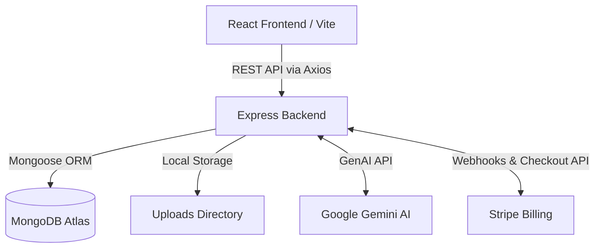
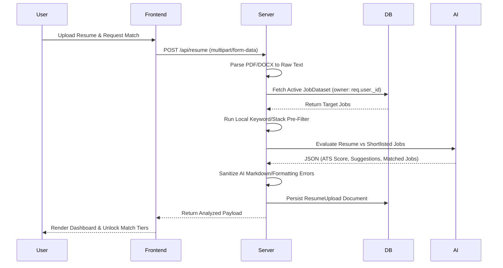

# JobLens — AI-Powered Job Market Analyzer

## Project Overview

JobLens is a multi-tenant, full-stack SaaS platform designed to bridge the gap between market analytics and candidate evaluation. The application allows users (recruiters, hiring managers, and job seekers) to upload proprietary job datasets, dynamically visualize market trends, and leverage Large Language Models (LLMs) to perform localized Applicant Tracking System (ATS) scoring.

By unifying data analytics and generative AI, JobLens provides instantaneous insights into salary distributions, top-demanded skills, and granular resume-to-job matching, all isolated securely per user through robust multi-tenant data architecture.

## Features

* **Multi-Tenant Data Isolation:** Secure, tenant-scoped data management ensuring users only interact with their proprietary uploads.
* **Robust Data Processing Engine:** Handles CSV/XLSX uploads with automatic data normalization, sanitization, hashing (SHA-256 for duplicate detection), and schema mapping.
* **Real-Time Analytics Dashboard:** Utilizes complex MongoDB aggregation pipelines to generate performance metrics, salary trends, and geographic distributions in real-time.
* **AI-Powered ATS Pipeline:** Integrates Google's Gemini LLM to parse resumes (PDF/DOCX), calculate ATS compatibility, identify skill gaps, and provide actionable improvement feedback.
* **Hybrid Matching Algorithm:** Combines an ultra-fast local keyword/stack signature pre-filter with a generative AI scoring mechanism to optimize API latency and cost.
* **Tiered Access & Monetization:** Integrated Stripe subscription management (Basic vs. Pro tiers) with programmatic daily quota tracking and automated webhook synchronization.
* **Session Resilience:** Engineered frontend authentication context that elegantly handles browser back/forward cache (bfcache) restorations and cross-tab state syncing.

## Tech Stack

| Domain | Technology / Library | Description |
| --- | --- | --- |
| **Frontend** | React, Vite, React Router | Component-based UI with client-side routing and fast hot-module replacement. |
| **Styling & UI** | Tailwind CSS, Framer Motion, Recharts | Utility-first styling, declarative animations, and data visualization. |
| **Backend** | Node.js, Express.js | Event-driven RESTful API server. |
| **Database** | MongoDB Atlas, Mongoose | NoSQL cloud database with strict object modeling and validation schemas. |
| **Authentication** | JWT, bcryptjs, cookie-parser | Stateless authentication utilizing `httpOnly` cookies and password hashing. |
| **File Processing** | Multer, xlsx, pdf-parse, mammoth | Handles `multipart/form-data`, spreadsheet parsing, and binary document text extraction. |
| **Integrations** | @google/generative-ai, stripe | External APIs for GenAI processing and subscription/payment management. |

## System Architecture



## Project Structure

```text
Job-Analyzer/
├── backend/
│   ├── config/
│   │   └── db.js                 # MongoDB connection logic
│   ├── controllers/              # Request handlers (business logic)
│   ├── middleware/
│   │   ├── auth.js               # JWT verification & tenant scoping
│   │   └── upload.js             # Multer configurations
│   ├── models/                   # Mongoose schemas (User, Job, JobDataset, ResumeUpload)
│   ├── routes/                   # Express route definitions
│   ├── scripts/                  # Database maintenance & migration utilities
│   ├── utils/
│   │   ├── aiService.js          # Gemini integration, sanitization & fallback logic
│   │   ├── matchPlan.js          # Tiered access quota rules
│   │   ├── parseExcel.js         # Spreadsheet ingestion & normalization
│   │   ├── parseResume.js        # PDF/DOCX text extraction
│   │   └── token.js              # JWT issuance and cookie management
│   ├── uploads/                  # Temporary blob storage for incoming files
│   └── server.js                 # Application entry point
├── frontend/
│   ├── src/
│   │   ├── api/                  # Axios instances and interceptors
│   │   ├── components/           # Reusable UI components (Modals, JobCards, etc.)
│   │   ├── context/              # React Context (AuthContext, ResumeAnalysisContext)
│   │   ├── pages/                # Route views (Dashboard, Analyzer, etc.)
│   │   ├── App.jsx               # Router configuration
│   │   └── main.jsx              # React DOM mounting
│   ├── .env.example
│   └── package.json
└── sample-data/                  # Seed files for guest demo modes

```

## Application Workflow



## Authentication Flow

Security and state consistency are maintained through a stateless JWT architecture tightly coupled with secure browser mechanisms:

1. **Issuance:** Upon successful registration or login, the backend generates a JWT and issues it via an `httpOnly`, `Secure` (in production) cookie, preventing XSS extraction.
2. **Validation:** The `auth.js` middleware validates the JWT signature on every protected route. If valid, the corresponding `User` object is injected into the request cycle (`req.user`), forming the basis of the multi-tenant isolation.
3. **Client State Resilience:** The React `AuthContext` listens for the browser's `pageshow` event. If the application is restored from the back/forward cache (`event.persisted`), the client silently re-validates the session against `/api/auth/me`. This guarantees UI consistency even when returning from external domains like the Stripe Billing Portal.
4. **Cache Control:** All `/api/auth/*` routes enforce strict `Cache-Control: no-store` headers to prevent intermediary proxy caching.

## Resume Analysis Flow

The core matching engine minimizes API latency and handles upstream LLM formatting inconsistencies via a structured pipeline:

1. **Extraction:** `pdf-parse` or `mammoth` extracts raw string data from the binary upload.
2. **Local Shortlisting:** Before invoking the LLM, the backend calculates a local keyword overlap and dominant tech-stack signature (e.g., classifying the resume as Java-heavy vs. Python-heavy). This filters a massive dataset down to a highly relevant subset, keeping the LLM prompt context window small and efficient.
3. **LLM Invocation:** The shortlisted data and resume text are sent to the Gemini API with a strict system prompt demanding plain-text JSON structure.
4. **Sanitization:** A dedicated parser (`cleanSuggestedImprovements`) intercepts the LLM output to repair fragmented arrays caused by rogue markdown emphasis tags or malformed sentence boundaries.
5. **Progressive Unlocking:** Data is persisted in MongoDB in full. The backend controller masks elements of the response (e.g., improvement suggestions, deep matches) dynamically based on the user's evaluated `subscriptionStatus` and daily quotas.

## Database Design

The application utilizes MongoDB Atlas with Mongoose ORM, structured around four primary collections. Strict multi-tenancy is enforced by scoping all queries with the `owner` object reference.

* **User:** Manages authentication identities, Stripe mapping (`stripeCustomerId`, `subscriptionStatus`), and tier metrics (`dailyMatchDate`, `dailyMatchCount`).
* **JobDataset:** Acts as a manifest for batch uploads, storing file hashes (`fileHash`) to prevent duplicate processing, and aggregation metrics for the upload event.
* **Job:** Individual job records populated from datasets. Contains normalized fields (`salaryMin`, `salaryMax`, `skills[]`) required for the aggregation pipelines.
* **ResumeUpload:** Persists historical AI analyses, caching the full Gemini output (`overallAtsScore`, `suggestedImprovements[]`, `recommendedJobs[]`) to allow instant fetching from the client without re-triggering expensive LLM calls.

## API Overview

*All protected routes require a valid JWT cookie and dynamically scope database queries to the authenticated user ID.*

| Prefix | Endpoints | Description |
| --- | --- | --- |
| `/api/auth` | `POST /signup`, `POST /login`, `GET /me`, `POST /logout` | Authentication, token issuance, and session verification. |
| `/api/upload` | `POST /upload-excel` | Ingests multipart files, validates schemas, and populates `Job` collections. |
| `/api/dashboard` | `GET /` | Executes MongoDB aggregation pipelines to return real-time dataset metrics. |
| `/api/jobs` | `GET /` | Returns paginated, searchable, and filterable job records. |
| `/api/resume` | `POST /`, `PATCH /matches` | Triggers the Gemini ATS pipeline and handles progressive tier unlocks. |
| `/api/history` | `GET /resumes`, `GET /datasets`, `DELETE /:id` | Retrieves previously analyzed data, dynamically masking payload based on current tier. |
| `/api/billing` | `POST /create-checkout-session`, `POST /webhook` | Stripe integration for subscription lifecycle management. |

## Environment Variables

### Backend (`backend/.env`)

| Variable | Description |
| --- | --- |
| `PORT` | API server port (default: 5000) |
| `MONGO_URI` | MongoDB Atlas connection string |
| `JWT_SECRET` | Cryptographic key for signing session tokens |
| `CLIENT_URL` | Frontend origin for CORS configuration (e.g., `http://localhost:5173`) |
| `GEMINI_API_KEY` | Google AI Studio API Key for LLM processing |
| `STRIPE_SECRET_KEY` | Stripe backend API key for creating sessions |
| `STRIPE_WEBHOOK_SECRET` | Stripe signature secret to verify incoming webhooks |

### Frontend (`frontend/.env`)

| Variable | Description |
| --- | --- |
| `VITE_API_URL` | Full URL to the backend API base (e.g., `http://localhost:5000/api`) |

## Installation

```bash
# Clone the repository
git clone https://github.com/your-username/joblens.git
cd joblens

# Install backend dependencies
cd backend
npm install

# Install frontend dependencies
cd ../frontend
npm install

```

## Running Locally

To run the application in development mode, open two separate terminal instances:

**Terminal 1: Backend**

```bash
cd backend
# Ensure .env is configured
npm run dev

```

**Terminal 2: Frontend**

```bash
cd frontend
# Ensure .env is configured
npm run dev

```

The application will be accessible at `http://localhost:5173`.

## Deployment

### Backend Deployment (Render / Fly.io / Heroku)

1. Provision a Node.js runtime environment.
2. Set the build command to `npm install` and the start command to `npm start`.
3. Configure all Backend environment variables. Ensure `CLIENT_URL` matches the deployed frontend origin exactly to satisfy CORS policies.

### Frontend Deployment (Vercel / Netlify)

1. Import the repository and set the root directory to `frontend`.
2. Framework preset: **Vite**.
3. Set the environment variable `VITE_API_URL` to point to your deployed backend domain.
4. Deploy.

### Stripe Webhook Configuration

In your Stripe Developer Dashboard, configure a webhook pointing to `https://<your-backend-url>/api/billing/webhook`. Subscribe to the following events:

* `checkout.session.completed`
* `customer.subscription.updated`
* `customer.subscription.deleted`

## Security

* **Stateless & Secure Auth:** Implementation of `httpOnly` cookies prevents XSS attacks from extracting access tokens.
* **Cryptographic Hashing:** User passwords are encrypted via `bcryptjs` with robust salting; file uploads utilize SHA-256 fingerprinting to validate integrity and prevent redundant storage.
* **Multi-Tenant Scoping:** Controller logic enforces strict database query parameters (`owner: req.user._id`), guaranteeing horizontal data isolation across the platform.
* **Webhook Integrity:** Stripe event signatures are cryptographically verified using `stripe.webhooks.constructEvent` to prevent spoofed subscription state changes.
* **Input Sanitization & Validation:** Multer intercepts and validates MIME types and file structures prior to buffer processing, mitigating malicious payload injections.

## Future Improvements

* **Cloud Blob Storage Integration:** Migrate the local `/uploads` directory abstraction to AWS S3 or Google Cloud Storage to support horizontally scaled server instances.
* **Advanced Job Scraping API:** Implement dynamic web scraping routines to auto-populate the `JobDataset` without requiring manual CSV/XLSX uploads.
* **Distributed Caching:** Introduce Redis to cache frequent analytical dashboard aggregation queries and reduce database load during peak traffic.
* **Frontend Code Splitting:** Leverage React `lazy` and `Suspense` for route-based chunking to optimize initial JS bundle size and improve Time to Interactive (TTI).

## License

This project is licensed under the MIT License - see the LICENSE file for details.


| Library / Technology      | Purpose (Short)                                    |
| ------------------------- | -------------------------------------------------- |
| **React**                 | Builds the frontend UI.                            |
| **Vite**                  | Fast React development and build tool.             |
| **React Router**          | Navigation between pages without reloading.        |
| **Axios**                 | Sends API requests from frontend to backend.       |
| **Tailwind CSS**          | Styling the UI.                                    |
| **Framer Motion**         | Animations and transitions.                        |
| **Recharts**              | Dashboard charts and graphs.                       |
| **Node.js**               | Runs JavaScript on the backend.                    |
| **Express.js**            | Creates REST APIs and handles requests.            |
| **MongoDB Atlas**         | Cloud database.                                    |
| **Mongoose**              | Connects Node.js with MongoDB and manages schemas. |
| **JWT (jsonwebtoken)**    | Creates login tokens for authentication.           |
| **bcryptjs**              | Hashes passwords securely.                         |
| **cookie-parser**         | Reads JWT cookies from requests.                   |
| **Multer**                | Uploads files (PDF, Excel).                        |
| **xlsx**                  | Reads Excel (.xlsx/.csv) files.                    |
| **pdf-parse**             | Extracts text from PDF resumes.                    |
| **mammoth**               | Extracts text from DOCX resumes.                   |
| **@google/generative-ai** | Connects to Gemini AI for ATS analysis.            |
| **Stripe**                | Handles online payments and subscriptions.         |

